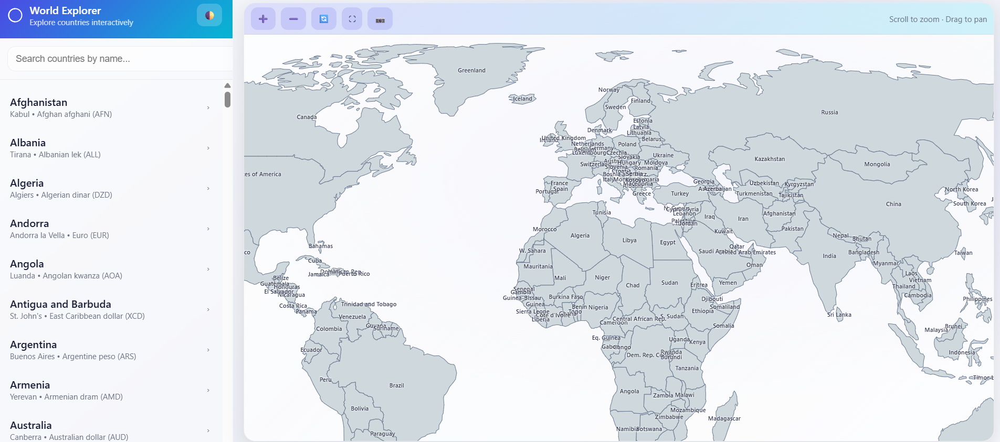
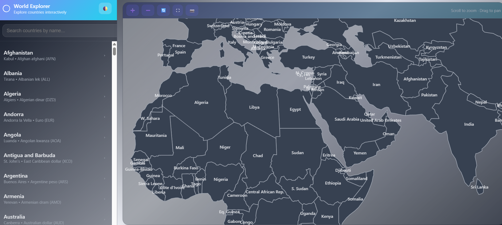
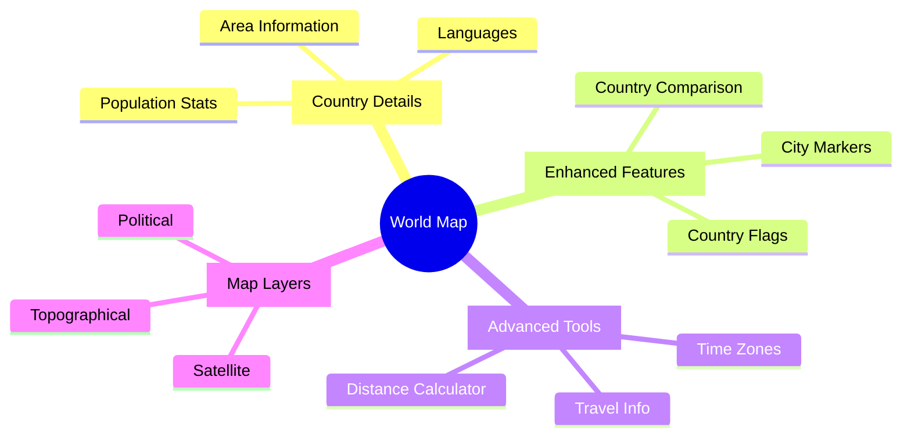

# 🌍 Interactive World Map Explorer

<div align="center">


**Explore the World at Your Fingertips: An Elegant & Interactive Geographic Experience**

[](LICENSE)
[](https://d3js.org)
[](https://github.com/topojson/topojson)
[](https://github.com/yourusername)

[✨ Live Demo](#) | [📖 Documentation](#) | [🚀 Quick Start](#getting-started) | [🤝 Contribute](#contributing)

</div>


---

## Table of Contents
- [Features](#features)
- [Screenshots](#screenshots)
- [Technologies](#technologies-used)
- [Getting Started](#getting-started)
  - [Prerequisites](#prerequisites)
  - [Install & Run](#installation)
- [Usage Guide](#usage-guide)
  - [Basic Navigation](#basic-navigation)
  - [Keyboard Shortcuts](#keyboard-shortcuts)
- [Customization](#customization)
- [Project Structure](#project-structure)
- [Browser Compatibility](#browser-compatibility)
- [Contributing](#contributing)
- [Future Enhancements](#future-enhancements)
- [License](#license)
- [Acknowledgments & Support](#acknowledgments--support)
- [Author](#author)

---

## ✨ Key Features

<table>
<tr>
<td width="50%">

### 🌍 Interactive Map
- 🎯 Beautifully rendered using D3.js + TopoJSON
- 🔄 Smooth zooming & panning capabilities
- 👆 Interactive country selection
- 📱 Fully responsive design

### 🎨 Modern UI/UX
- 🌓 Dark / Light theme switcher
- ↔️ Collapsible sidebar navigation
- 🖥️ Immersive fullscreen mode
- ✨ Elegant animations & transitions

</td>
<td width="50%">

### 🔍 Smart Navigation
- ⚡ Real-time country search
- ⌨️ Keyboard shortcuts support
- 📍 Auto-scroll & country tracking
- 🎯 Quick country zooming

### 🛠️ Power Features
- 📸 Map screenshot export (PNG)
- 🎮 Intuitive zoom controls
- 💫 Interactive hover effects
- 📊 Country information panel

</td>
</tr>
</table>

---

## Screenshots

- Sidebar + Map
  

- Dark Mode
  

---

## 🛠️ Technologies Used

<div align="center">

[](https://skillicons.dev)

</div>

<table>
<tr>
<td>
  
</td>
<td>
  <strong>HTML5</strong><br/>
  Semantic markup for structured content
</td>
</tr>
<tr>
<td>
  
</td>
<td>
  <strong>CSS3</strong><br/>
  Modern styling with CSS variables & animations
</td>
</tr>
<tr>
<td>
  
</td>
<td>
  <strong>JavaScript (ES6+)</strong><br/>
  Powerful application logic & interactions
</td>
</tr>
<tr>
<td>
  
</td>
<td>
  <strong>D3.js (v7.8.5)</strong><br/>
  Advanced map rendering & data visualization
</td>
</tr>
<tr>
<td>
  
</td>
<td>
  <strong>TopoJSON (v3.0.2)</strong><br/>
  Efficient geographic data encoding
</td>
</tr>
</table>

---

## 🚀 Getting Started

### Prerequisites

<table>
<tr>
<td>✅</td>
<td>Modern Web Browser</td>
<td>Chrome, Firefox, Safari, or Edge</td>
</tr>
<tr>
<td>✅</td>
<td>Local Setup</td>
<td>No server required - runs client-side!</td>
</tr>
<tr>
<td>⭐</td>
<td>Optional</td>
<td>Node.js or Python for local development</td>
</tr>
</table>

### ⚡ Quick Installation

```bash
# 1️⃣ Clone the Magic
git clone https://github.com/yourusername/interactive-world-map.git

# 2️⃣ Enter the Project
cd interactive-world-map

# 3️⃣ Choose Your Server (Optional)
# 🐍 Python Style
python -m http.server 8000

# 📦 Node.js Style
npx http-server -p 8000
```

### 🌐 Launch

<table>
<tr>
<td width="40px">
  
</td>
<td>

Open your browser and navigate to:
- 🔗 [http://localhost:8000](http://localhost:8000) (if using local server)
- 📂 Or simply open `index.html` directly

</td>
</tr>
</table>

---

## Usage Guide

### Basic Navigation
- **Select a country**: Click a country on the map or click its name in the sidebar.
- **Search countries**: Use the search box to filter country names in real-time.
- **Zoom**: Use `+` and `-` buttons, mouse wheel, or pinch gestures on touch devices.
- **Reset view**: Click the reset (⟲) button to return to the default world view.
- **Fullscreen**: Click the fullscreen (⛶) button.
- **Export**: Click the camera (📷) button to export the current map view as an image.

### Keyboard Shortcuts
- `↑ Arrow` — Move selection to the previous country.
- `↓ Arrow` — Move selection to the next country.
- `Esc` — Exit fullscreen (if active).

---

## Customization

### Theming (Dark / Light)
The app uses CSS variables at the root to control colors. To change or add themes, edit the `:root` or `.dark-theme` variables in `assets/css/styles.css`.

---

## Project Structure
```
interactive-world-map/
├── index.html              # Main HTML file
├── README.md               # This file
├── LICENSE                 # MIT License
├── assets/
│   ├── css/
│   │   └── styles.css      # Theme & layout styles
│   ├── js/
│   │   ├── main.js         # App logic, D3 map rendering
│   │   └── data/
│   │       └── countries.json  # Optional metadata
│   └── images/
│       └── (screenshots, demo.gif)
└── data/
    └── world-110m.topojson # TopoJSON file or fetched dynamically
```

---

## Browser Compatibility
- Chrome 60+
- Firefox 55+
- Safari 12+
- Edge 79+

---

## Contributing
1. Fork the repo
2. Create a branch: `git checkout -b feature/amazing-feature`
3. Make your changes and commit: `git commit -m "Add amazing feature"`
4. Push to your branch: `git push origin feature/amazing-feature`
5. Open a Pull Request

---

## 🔮 Future Enhancements

<div align="center">



</div>

## 📜 License

<div align="center">
  
[](LICENSE)

This project is licensed under the MIT License - see the [LICENSE](LICENSE) file for details.

</div>

## 💝 Acknowledgments

<div align="center">

### Built With Amazing Tools & Data

[](https://d3js.org)
[](https://github.com)
[](https://github.com)

### Need Help?

[](https://github.com/yourusername/interactive-world-map/issues)

</div>

## 👨‍💻 Author

<div align="center">

### MD. SHAKIL MIA

[](https://meetshaks.github.io/Shakil_Ahmed/#home)
[](https://www.linkedin.com/in/shakil-ahmed-dev/)
[](https://github.com/meetshaks)

</div>  

